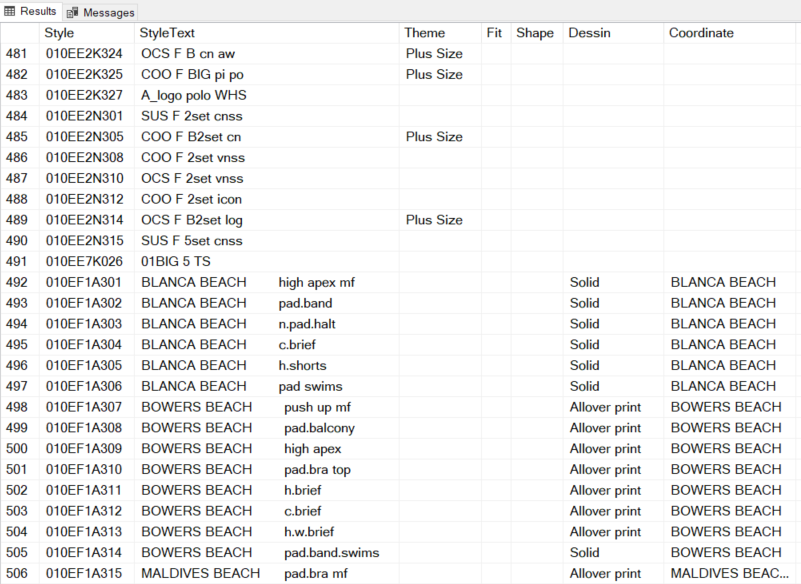
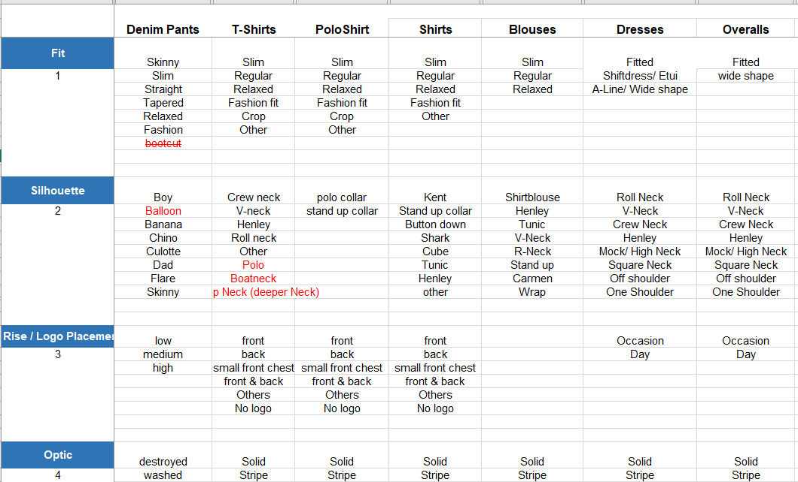
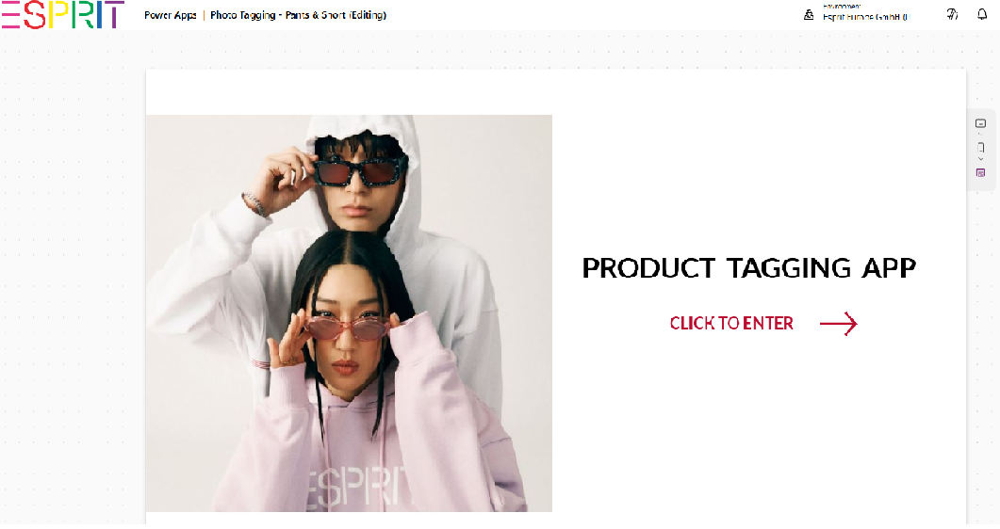
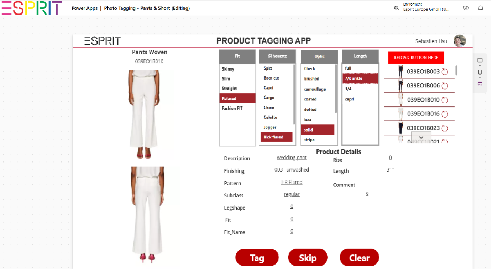
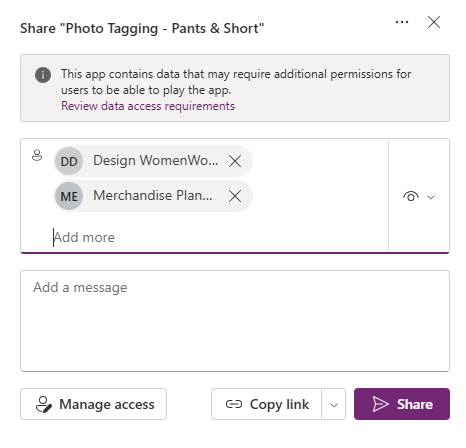
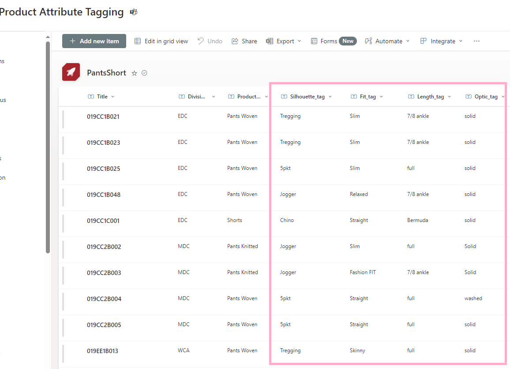
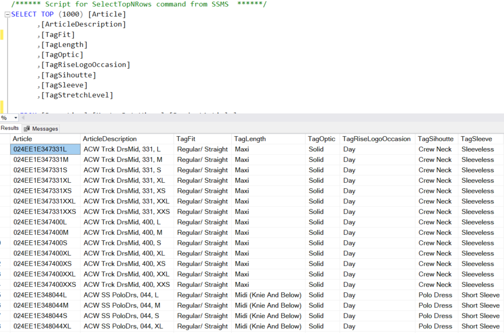
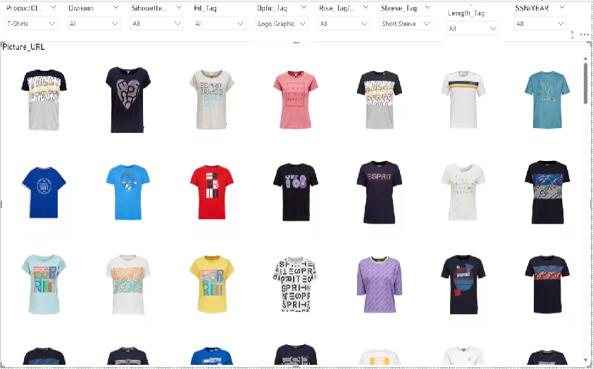

# Power_Apps 
## Power Apps & Product Tagging Creation/ Management (ETL)

### Background - 
During the style creating process, style information is always missing, not consistant, different terms.

This makes it difficult if we want to look deeper into how different design/ shape/ color affecting the sales.



### Step 1 Define the attributes
In order to solve this issue, the attribute groups was created and tags were allocated to each product group.



### Step 2 Create the App
After the arrtibute was created, the we started creating the product tagging app using Microsoft Power Apps application.




```
Code for the tag button -

Refresh(PantsShort);
//Here is to patch to T1
Patch(
        PantsShort,
        LookUp(
            PantsShort,
            Style = Gallery1.Selected.Name
        ),
        {   
           Silhouette_tag:'ListBox - Silhiuette'.Selected.Silhouette,
           Fit_tag:'ListBox - Fit'.Selected.Fit,
//           'Rise_tag/LogoPlacement_tag':'ListBox - Rise'.Selected.Logo_Or_Rise,
           Length_tag:'ListBox - length'.Selected.Length,
           Optic_tag:'ListBox - Optic'.Selected.Optic,
//           Sleeve_Tag:'ListBox - Sleevelength'.Selected.'Sleeve length',
           Completed:"YES",
           Blocked:User().FullName                              
        }
    );
    
Refresh(PantsShort);

Reset('ListBox - Fit');Reset('ListBox - Silhiuette');Reset('ListBox - Optic');Reset('ListBox - length');

Refresh(PantsShort);

Patch(
        PantsShort,
        LookUp(
            PantsShort,
            Style = Gallery5.Selected.Name
        ),
        {  
           Blocked:User().FullName                              
        }
    );

Refresh(PantsShort);
```

```
code for the skip button -

Refresh(PantsShort);

//Here is to patch to T1
Patch(
        PantsShort,
        LookUp(
            PantsShort,
            Style = Gallery1.Selected.Name
        ),
        {  
           Completed:"SKIP",
           Blocked:User().FullName                              
        }
    );
    
Refresh(PantsShort);

Patch(
        PantsShort,
        LookUp(
            PantsShort,
            Style = Gallery2.Selected.Name
        ),
        {  
           Blocked:User().FullName                              
        }
    );

Refresh(PantsShort);
```
```
code for the clear button -

Reset('ListBox - Fit');Reset('ListBox - Rise');Reset('ListBox - Silhiuette');Reset('ListBox - Optic');Reset('ListBox - Sleevelength');Reset('ListBox - length');
Refresh(PantsShort)

```
### Step 3 Distribute the App & Start tagging
After the app is tested, then it was distributed to relevant groups for them to tag each style.




### Step 4 Extract data and load to Datalake
The result is firstly collected by sharepoint and then transferred to SQL datalake

Sharepoint List


SQL View


### Final Step Power BI report & All reports
After the result is on Datalake, then it can be used in all aspects when looking deeper into product categories.

Example 1 - T-shirt (Filtered on Logo Graphic & Short Sleeve)


Example 2 - In most group reporting, this is also merged into the filters


